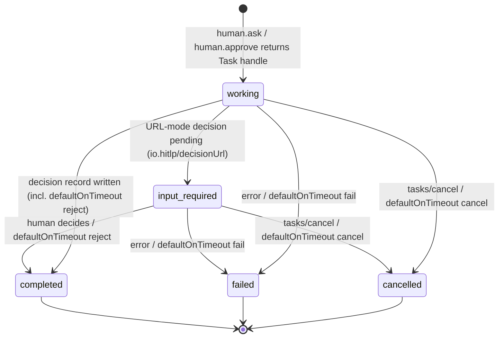

# hitlp

human-in-the-loop-protocol - originally authored by Mike Peterson and Matt Lund

Agents have a standard way to call tools but no standard way to call people. HITLP
fills that gap: it models a human as a **typed resource** that an agent calls the way
it calls a tool, over MCP Tasks, and later reads back a structured, attributable
decision record. Routing, delivery, reminders, escalation and audit belong to a
**HITLP server**; the agent sees only ordinary MCP tool calls and task handles. See
[spec/hitlp.md §1](spec/hitlp.md#1-introduction) for the full introduction.

## Architecture

<svg xmlns="http://www.w3.org/2000/svg" width="720" height="200" viewBox="0 0 720 200" font-family="sans-serif" font-size="13">
  <rect x="10" y="60" width="140" height="70" rx="8" fill="#eef3ff" stroke="#3a5bbf"/>
  <text x="80" y="90" text-anchor="middle">Agent</text>
  <text x="80" y="110" text-anchor="middle" font-size="11">(checkpoints handle)</text>
  <rect x="260" y="40" width="200" height="110" rx="8" fill="#f2fbf2" stroke="#2e8b57"/>
  <text x="360" y="70" text-anchor="middle">HITLP server</text>
  <text x="360" y="92" text-anchor="middle" font-size="11">durable task store</text>
  <text x="360" y="110" text-anchor="middle" font-size="11">routing · escalation</text>
  <text x="360" y="128" text-anchor="middle" font-size="11">decision records</text>
  <rect x="570" y="20" width="140" height="40" rx="8" fill="#fff6e8" stroke="#c07a12"/>
  <text x="640" y="45" text-anchor="middle">Chat / SMS</text>
  <rect x="570" y="75" width="140" height="40" rx="8" fill="#fff6e8" stroke="#c07a12"/>
  <text x="640" y="100" text-anchor="middle">Inbox</text>
  <rect x="570" y="130" width="140" height="40" rx="8" fill="#fff6e8" stroke="#c07a12"/>
  <text x="640" y="155" text-anchor="middle">Hosted decision page</text>
  <line x1="150" y1="85" x2="258" y2="85" stroke="#333" marker-end="url(#a)"/>
  <text x="204" y="78" text-anchor="middle" font-size="11">human.ask / approve</text>
  <line x1="258" y1="110" x2="152" y2="110" stroke="#333" marker-end="url(#a)"/>
  <text x="204" y="126" text-anchor="middle" font-size="11">Task handle, status</text>
  <line x1="460" y1="80" x2="568" y2="40" stroke="#333" marker-end="url(#a)"/>
  <line x1="460" y1="95" x2="568" y2="95" stroke="#333" marker-end="url(#a)"/>
  <line x1="460" y1="110" x2="568" y2="150" stroke="#333" marker-end="url(#a)"/>
  <defs><marker id="a" markerWidth="8" markerHeight="8" refX="7" refY="4" orient="auto"><path d="M0,0 L8,4 L0,8 z" fill="#333"/></marker></defs>
</svg>

The agent talks MCP to the server and never to a human directly. The server picks the
humans, renders the request for each channel, and records the decision. Full diagram:
[spec/hitlp.md §2](spec/hitlp.md#2-architecture).

## The v1 primitives

- **Ask** (`human.ask`): poses a question whose answer the server validates against a
  JSON Schema. [spec/hitlp.md#41-ask](spec/hitlp.md#41-ask)
- **Approve** (`human.approve`): asks a human to approve or reject an action, with a
  reason. [spec/hitlp.md#42-approve](spec/hitlp.md#42-approve)

### Task lifecycle



More diagrams, including the Ask message-flow sequence diagram, are in
[diagrams/](diagrams/README.md).

## Example

"ask" is one of several flows. Example:

```
[agent] Asking the human for their name (human.ask) ...

[wire] -> human.ask arguments
       {
         "idempotencyKey": "fd6dfaa4-e7ae-48e4-9520-e3f06c1db6ad",
         "deadline": "2026-10-08T16:03:11.898089Z",
         "defaultOnTimeout": "cancel",
         "priority": "normal",
         "requester": { "agent": "hitlp-hello-dotnet" },
         "question": "What is your name?",
         "responseSchema": { "type": "string", "minLength": 1 }
       }

[wire] <- task handle
       { "taskId": "task-1", "status": "working", "pollInterval": 10 }

[human] What is your name? Ada

[wire] <- tasks/get task-1 (terminal)
       {
         "taskId": "task-1",
         "status": "completed",
         "pollInterval": 10,
         "result": {
           "requestId": "task-1",
           "idempotencyKey": "fd6dfaa4-...",
           "decidedBy": { "type": "human", "id": "terminal-human" },
           "channel": "terminal",
           "primitive": "ask",
           "outcome": "answered",
           "answer": "Ada",
           "decidedAt": "2026-10-08T15:03:11.96774Z"
         }
       }

[agent] Hello, Ada!
```

## Try it

Runnable hello-world demos, one per SDK, are in [demos/](demos/README.md):

- TypeScript: `cd demos/typescript && npm start`
- Python: `cd demos/python && python hello.py`

## Repo map

- [spec/](spec/hitlp.md): the protocol specification.
- [spec/schemas/](spec/schemas/): JSON Schemas for the request and decision shapes.
- [diagrams/](diagrams/README.md): Mermaid diagrams of the Ask and Approve sub-protocols.
- [sdks/](sdks/README.md): client SDKs, in TypeScript, Python, Java and .NET.
- [demos/](demos/README.md): runnable hello-world demos built on the SDKs.
- [server/](server/README.md): a reference server (TypeScript, SQLite task store).
- [conformance/](conformance/README.md): a black-box conformance suite for any server.

See [LICENSE](LICENSE) for license terms.
