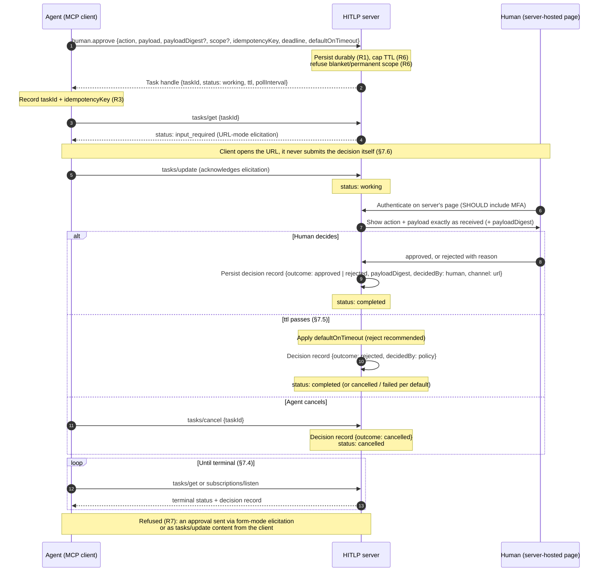

# Approve: message flow

The Approve sub-protocol of the human-in-the-loop protocol (HITLP), carried by the
`human.approve` tool over the MCP Tasks binding. Spec:
[§4.2 Approve](../spec/hitlp.md#42-approve),
[§7.6 URL-mode](../spec/hitlp.md#76-url-mode-for-human-only-decisions),
[§8 rules](../spec/hitlp.md#8-normative-async-and-security-rules).

The agent must treat any terminal state, including a timeout, as the answer and must not
assume approval from silence (R2).
