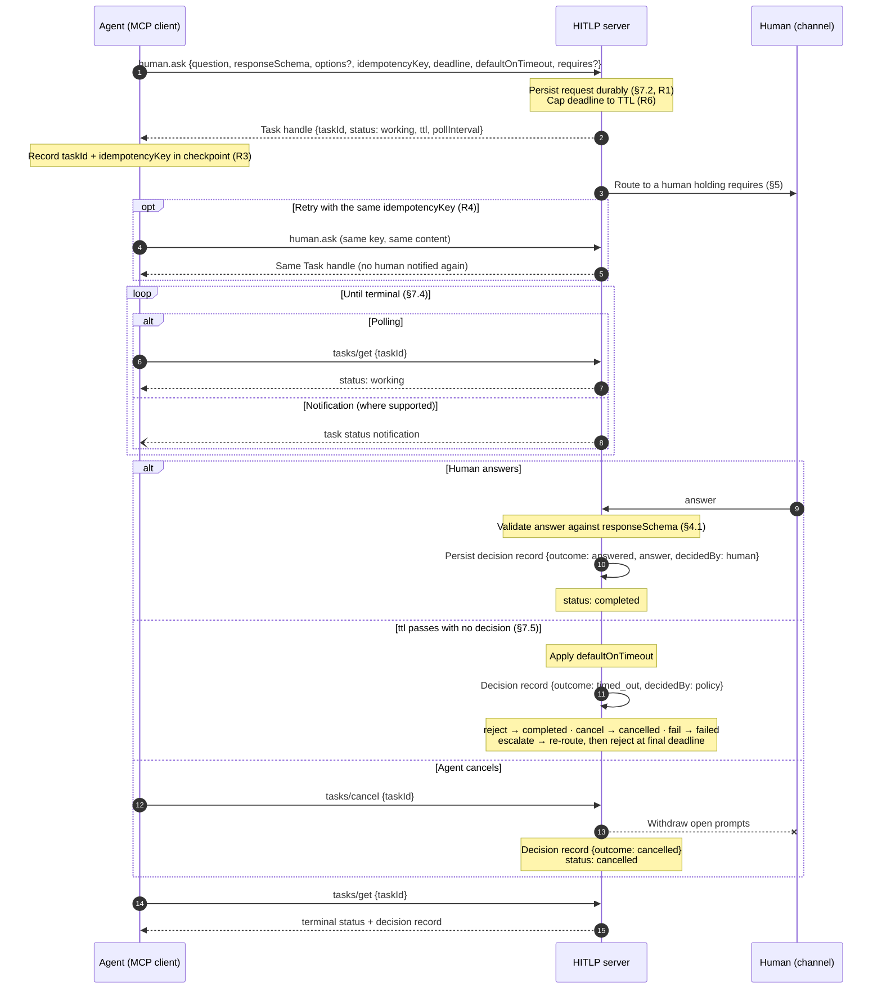

# Ask: message flow

The Ask sub-protocol of the human-in-the-loop protocol (HITLP), carried by the `human.ask`
tool over the MCP Tasks binding. Spec: [§4.1 Ask](../spec/hitlp.md#41-ask),
[§5 envelope](../spec/hitlp.md#5-common-request-envelope),
[§7 binding](../spec/hitlp.md#7-binding-over-mcp-2026-07-28).

An Ask whose answer authorizes something must be gathered on a human-only surface, as
for [Approve](approve.md) ([§7.6](../spec/hitlp.md#76-url-mode-for-human-only-decisions)).
