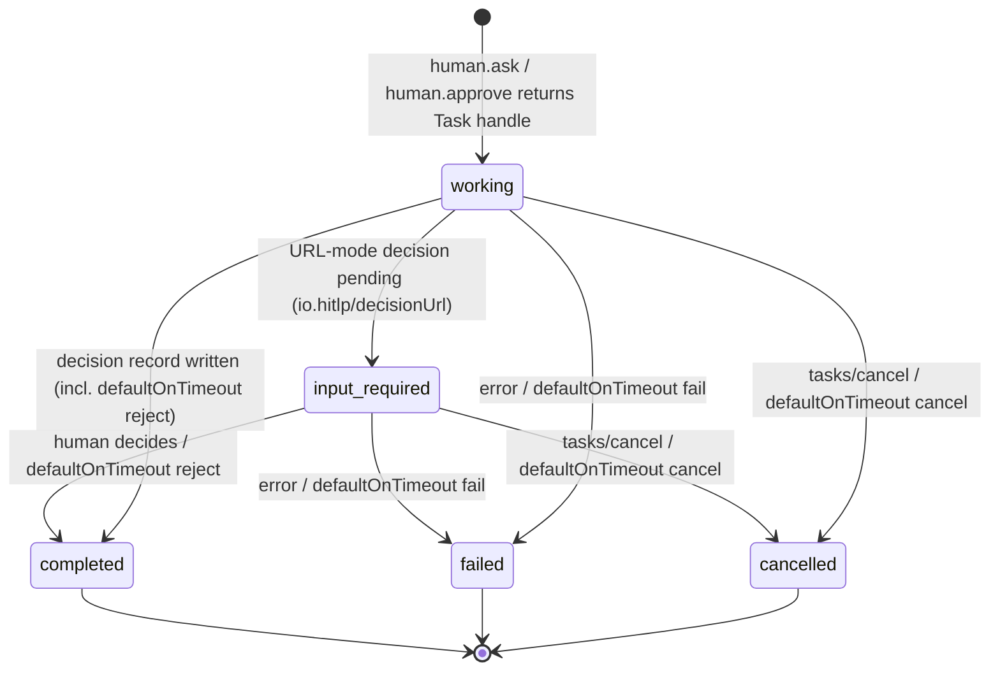

# Task lifecycle

The task statuses shared by both HITLP sub-protocols, [Ask](ask.md) and
[Approve](approve.md). Spec: [§7.3 Statuses and lifecycle](../spec/hitlp.md#73-statuses-and-lifecycle),
[§7.5 TTL expiry](../spec/hitlp.md#75-ttl-expiry-and-the-default-action).

`completed`, `failed` and `cancelled` are terminal and never change again.
